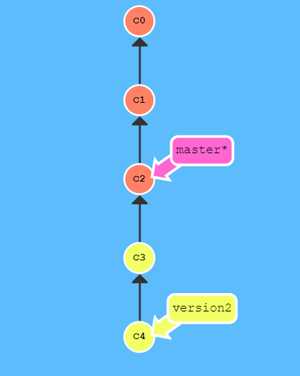
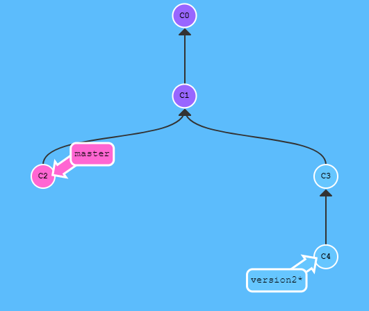
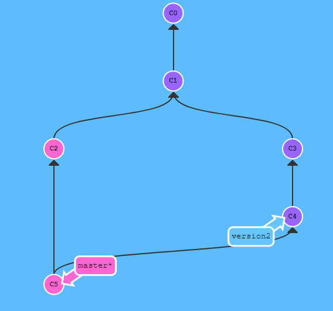

### 2019.04.04 Step 1-4

## git 사용하기

------

git != github

**GIT = DVCS (Distributed Version Control System)**


**git을 사용하는 이유는?**

- 협업할 때 git의 장점이 드러난다.
- 이전 version으로 돌아가기 용이하다.

**git init  수행시**

```
drwxr-xr-x   3 csheum  staff    96B  4  4 10:51 .
drwxr-xr-x   3 csheum  staff    96B  4  4 10:49 ..
drwxr-xr-x  10 csheum  staff   320B  4  4 10:51 .git
```

.git 이 local repository이다. 

- working tree(working dir.)
  - .git을 제외한 공간
- local repository
  - .git이다.
- file(source code) 편집

**git에서 가장 중요한 것 한가지를 말한다면?**

- **commit** == Save point

- 한번 commit을 하면 안전하게 저장이 되어 있다. 

- 어디에 들어있나 =>>>> Local Repository 

  (Local이기 때문에 접근이 제한적이며 내 컴퓨터에 문제가 생기면 위험해진다. )

**git에는 뭐가 있나**

- 로컬 저장소
- 원격 저장소
- 스테이지 - 커밋을 준비하는 곳
- 작업 디렉토리

**commit** : stage의 내용들을 갖고 commit object를 만드는 행동


`git add <filename>`  을 수행하면 stage에 올리는 것이다.

`git status` : working directory, stage, commit 이 3가지가 어떻게 차이를 갖고 있는지 보여준다.

`git commit` : -m option 없이 사용하면 message를 자세하게 쓸 수 있다

`git log` 로 commit 을 확인해보자


commit 객체는 .git의 objects 에 저장되어 있다.


### Honux  Git 강의 1강

------

commit 주의사항

1.  반드시 한 번에 하나의 논리적 작업만을 Commit한다.
2. commit message를 상세하게 쓴다.
3. 첫 줄에 간단하지만 명확한 내용을 쓰고 한줄 비우고 자세한 내용 작성


### Honux git 강의 2, 3: GIT 변경사항 취소하기

------

**`branch`** - 기존 내용을 유지한 채 새로운 내용을 추가하고 싶을 때 사용한다.

**`checkout`** 을 이용하면 아주 쉽게 마지막 커밋으로 되돌아 갈 수 있다!

- 특정 branch(또는 commit)으로 돌아가고 싶을 때 사용.


`git checkout cbb94d62d2269ad93e2cc3c779f0e111906a3a85`

을 실행하면 다음과 같이 message가 출력된다

```
Note: checking out 'cbb94d62d2269ad93e2cc3c779f0e111906a3a85'.

You are in 'detached HEAD' state. You can look around, make experimental
changes and commit them, and you can discard any commits you make in this
state without impacting any branches by performing another checkout.

If you want to create a new branch to retain commits you create, you may
do so (now or later) by using -b with the checkout command again. Example:

  git checkout -b <new-branch-name>

HEAD is now at cbb94d6 Add new file named hehe.txt
```


해당 commit으로 돌아간뒤 수정을 가하거나 새로운 commit을 생성해내거나 branch로 만드는 것도 가능하다. 

commit으로 가면서 동시에 그 commit을 branch로 만들고 싶으면

```bash
git checkout -b test-branch 56a4e5c08
```

를 해주면 된다.


**추가로 찾아본 내용**

하지만 branch 생성이 없이 그냥 commit으로 돌아가게 되면

 "detached HEAD" state가 되는데 말그대로 독립된 헤드인 것이다.

만약 이 commit에서 수정을 가하고 다시 commit을 하더라도 다시 master나 다른 branch들로 이동할 경우 수정 사항은 사라진다. 따라서 위처럼 branch로 지정을 해주면 수정사항들을 저장할 수 있게 된다.


특정 commit에서 branch를 생성할 수 있으며, 필요할 경우 해당 branch를 삭제할 수 있는데 merge가 진행되지 않은 branch의 경우

`git branch -d <branchname>` 

이고 이미 merge가 진행된 경우

`git branch -D <branchname>`	이와 같이 대문자로 Deletion option을 준다.


### 오후 강의

------

git은 내용기반이기 때문에 중복되는 내용에 대해서 효율적으로 저장한다.

실제 파일은 object에


- reset : HEAD와 branch를 동시에 해당 commit으로 옮김

- rebase:  현재까지의 변경사항을 통째로 다른곳에 얹어놓는다.

  rebase와 merge가 유사한 경우인데

  rebase가 위험한 경우가 있다.

  - rebase는 새로운 commit을 만들어내는 것이기 때문에 원격저장소에 이미 올라간 경우 복제된 commit들을 만들어낸다.

- merge는 commit이 날아가지 않기 때문에 복구가 용이하고 안전하다. 


###  Honux git 강의 4: GIT merge!

------

**merge** : 하나의 브랜치를 현재 브랜치와 합치는 것

**HEAD branch** : 현재 branch


**상황 1** : HEAD branch에 변경 사항이 없을 경우 !

1. 합치려는 branch가 HEAD branch로부터 시작됐다.
2. 그 사이 HEAD branch에는 갱신이 없었다!




단순히 master branches 가리키는 commit을 c4로 옮겨주면 되는거니까,

브랜치의 참조만 갱신되는 상황이다!


**상황2**  : 가지가 생겨난 경우

------

1. 과거의 commit으로부터 branch를 생성해서 작업을 한 경우
2. 새로운 branch 작업 이후에 HEAD에 다른 새 commit이 있는 경우
3. 여러 branch를 동시에 작업하면서 merge를 시도할 경우

위 3가지 경우가 속한다.



마찬가지로 HEAD branch에서 target branch를 병합하면 된다.

하지만 이 때 여러 branch에서 동시에 변경한 filedl 있을 경우 conflict가 발생할 수 있다. 

혼자 작업하는 경우의 충돌 해결 케이스

1. 보통 가장 최신 내용 하나만 선택하면 되는 경우
2. 최신 내용은 보통 target branch에 있는 경우가 많음
3. 여러 파일에 변경 사항이 혼재해 있는 경우도 내가 개발했으므로 크게 어렵지 않다. 

잘 해결할 경우 아래와 같은 모양이 된다.




### Honux git 강의 5: git pull과 충돌 해결하기!

------

- conflict는 merge 실패시 발생한다. 
- 안쓰는 branch를 삭제한다. 
  - 현재 branch(HEAD)가 아닌 경우 간단하게 삭제 가능
  - branch를 삭제했을 경우 사라지는 commit이 있는지 없는지 확인

**git pull**

- server의 내용이 최신일 경우 pull을 적용한다. 
- pull = fetch + merge

**충돌의 발생원인**

- merge를 실패했을 경우 발생
- 보통 다른 가지의 두 commit이 같은 파일을 편집했을 경우 발생한다.

**해결방안**

- 에디터를 이용한 해결
  - 충돌난 파일을 꼼꼼히 읽어가며 수동으로 수정한다.
- merge tool을 이용한 해결
- sourceTree를 이용한 해결
- 혼자 작업할경우 두 변경사항중 하나가 최신이고 정답일 가능성이 높음
- 해결했는데 이상해졌다면 reset을 이용한다!


### Honux git 강의 6: reset으로 commit 되돌리기

------

```bash
git reset <target commit>
```

`reset --soft` 는 HEAD가 가리키는 branch를 target commit으로 옮기기만 한다. HEAD만 target commit으로 가게 되고 working dir과 stage는 여전히 기존의 상태를 유지


`reset --mixed` 는 stage에도 변경을 가한다.


`reset --hard` 는 stage와 working dir까지 target commit의 상태로 모두 변경을 한다.-> 이전 commit은 사라지게 된다.


`reset` 이후의 push는 `--force` 옵션을 선택해야 한다.


### Honux git 강의 7: 새로운 branch로 돌아가기

------

1. 되돌릴 target commit으로 branch 생성
2. 해당 branch로 checkout
3. 변경 사항 수정 후 commit
4. master에 merge

장점 : 쉽다. 기록이 모두 남는다.

단점 : 트리가 지저분해진다.

- 만약 master에서 수정된 파일과 새로운 branch에서 수정된 파일이 겹친다면 conflict가 발생하지 않을까

### Honux git 강의 8: Revert를 사용해 commit 되돌리기

------

```
git revert <되돌릴 커밋> 
```

 여러개의 commit을 되돌리고 싶다면 아래처럼 범위설정이 가능하다.

```
git revert 2664ce8..15413dc
```

 장점 : 이전 commit 기록이 다 남아 있다.

 단점 : 충돌 날 가능성이 매우 높다. 다소 어렵다.


### Codesquad PR 과정 재정리

1. 팀 프로젝트 저장소에 내 아이디에 해당하는 branch가 있는지 확인 후 없을 경우 프로젝트 마스터에게 branch 생성을 요청한다. branch 생성 이후

2.  프로젝트를 내 계정으로 fork한다. 

3. fork한 프로젝트를 자신의 컴퓨터로 clone한 후 디렉토리로 이동한다. 

   ```bash
   git clone -b nailer --single-branch https://github.com/nailer/team_04_04
   ```

   특정 branch 하나만을 local로 clone해야 할 경우 위와 같이 옵션을 줄 수 있다. (-b와 —single-branch는 동일한 역할이기 때문에 하나만 사용해도 된다.)

4. 기능 구현을 위한 브랜치 생성(여기부터 반복)

   ```bash
   git checkout -b step1
   ```

5. 기능 구현 후 add, commit

   step 1에 대해 수정을 가하고, 

   ```bash
   git commit -m "수정사항 등"
   ```

6. 내 원격 저장소에 올리기

   ```bash
   git push origin step1
   ```

7. GitHub 서비스에서 pull request를 보낸다.

   이거는 내가 작업한 내 저장소로 가서 해당 branch를 선택한 후 pull request버튼을 누르면 할 수 있다.

8. 이제 pull request를 reviewer가 피드백을 하고 reject를 먹으면 다시 수정해서 다시 pull request를 날린다. 마침내 reviewer가 승인하면 마스터에 의해서 merge가 진행된다.

9. merge를 완료했다는 통보를 받으면 branch 변경 및 작업 branch 삭제한다.

   (완료되었기 때문에 step1은 원격 저장소)

   ```bash
   git checkout nailer
   git branch -D step1
   ```

10. merge한 codesquad 저장소와 동기화하기 위해 codesquad 저장소 추가

    (upstream이란 리모트를 등록하는데 이건 최초 한번만 한다)

    ```bash
    git remote add upstream https://github.com/codesquad/specificproject
    ```

11. codesquad 저장소에서 내 branch 갖고오기(갱신하기)

    ```bash
    git fetch upstream nailer
    ```

    내 이름의 저장소 nailer에 팀 프로젝트 upstream을 갖고 온다.

    (위 과정으로 생각해보면 step1의 내용이 nailer에 적용되게 된다.)

12. codesquad 저장소 branch와 동기화하기

    ```bash
    git rebase upstream/nailer
    ```

이후 4단계부터 다시 진행


